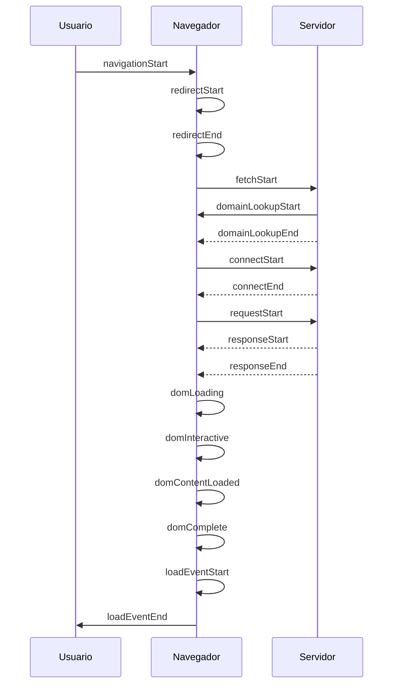

Imagen en Docker y script en Python para realizar pruebas de navegación utilizando Selenium y Chromium en una Raspberry Pi (v8, >4b)

# Uso
1. Instalar Docker en Raspberry Pi ([Guia oficial de instalación](https://www.raspberrypi.org/blog/docker-comes-to-raspberry-pi/))
2. Clonar este repositorio.
3. Prueba la imagen y el script utilizando el siguiente comando:
```
docker run --rm -w /tmp -v $(pwd):/tmp cfuentealba/chromium-arm64:0.1 python3 test.py
```

Imagen en Dockerhub: https://hub.docker.com/r/cfuentealba/chromium-arm64

## Funcionamiento del script


Acá se describe la secuencias de eventos que ocurren cuando se carga una página web:

- *navigationStart*: Comienza la navegación. Esto es cuando el usuario ha ingresado una URL o ha hecho clic en un enlace para cargar una nueva página web.
- *redirectStart y redirectEnd*: Si hay una redirección (por ejemplo, la URL original redirige a otra URL), estos eventos marcan el inicio y el fin de la redirección.
- *fetchStart*: Comienza la búsqueda de la página web en el servidor.
- *domainLookupStart y domainLookupEnd*: Se inicia y se finaliza la búsqueda del dominio. Esto se refiere al proceso de encontrar la dirección IP del servidor que aloja la página web.
- *connectStart y connectEnd*: Se inicia y se finaliza la conexión al servidor. Esto es cuando el navegador está estableciendo una conexión con el servidor que aloja la página web.
- *requestStart*: Comienza la solicitud de la página web. El navegador ha solicitado la página web al servidor.
- *responseStart y responseEnd*: Se inicia y se finaliza la respuesta del servidor. El servidor ha comenzado a enviar la página web al navegador y luego ha terminado de hacerlo.
- *domLoading*: Comienza la carga del Modelo de Objeto de Documento (DOM). Esto es cuando el navegador está empezando a construir la estructura de la página web.
- *domInteractive*: El DOM está lo suficientemente cargado como para que el usuario pueda interactuar con la página web, aunque todavía puede estar cargando otros recursos (como imágenes).
- *domContentLoaded*: Todo el contenido del DOM se ha cargado, incluyendo scripts que necesitan ser ejecutados antes de que el evento load ocurra.
- *domComplete*: El DOM está completamente cargado y procesado.
- *loadEventStart y loadEventEnd*: Se inicia y se finaliza el evento de carga. Esto es cuando todos los recursos de la página web (como imágenes y scripts) se han cargado completamente.
